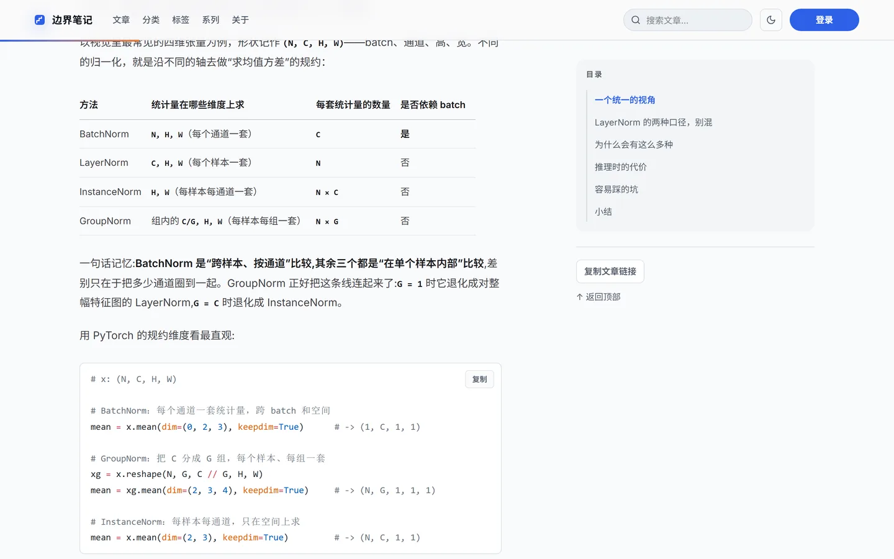
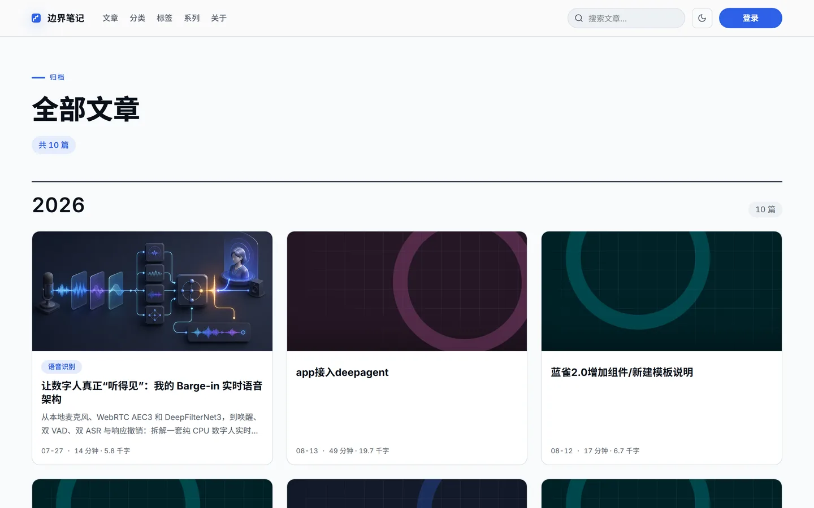
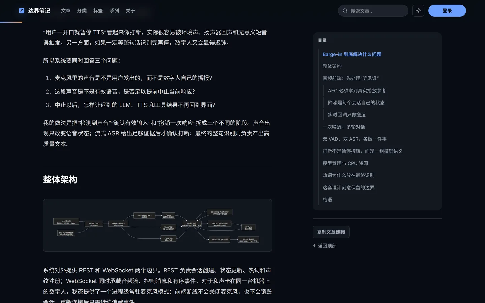

# 边界笔记 · Boundary Notes

一套自托管的多作者技术博客平台,支撑着 [xiudou.site](https://xiudou.site) 的日常运行。

> **English summary** — A self-hosted, multi-author blogging platform built on Next.js 16 (App Router / RSC) and PostgreSQL. It ships a full content workflow (Markdown authoring with live sanitized preview, revisions with optimistic locking, scheduled publishing), an account system (Auth.js credentials + GitHub OAuth, TOTP MFA, session registry, rate limiting), and a transactional mail pipeline with an encrypted outbox. Everything runs from one `docker compose up`. Chinese documentation below; open an issue if you would like it translated in full.

---

## 这个项目是干什么的

我写大模型推理优化方向的长文,里面有大量代码块、数学公式和架构图。市面上的博客方案要么托管在别人手里、渲染管线不可控,要么只是静态生成器,撑不起账号、评论和定时发布。所以我自己建了一套。

它解决三类问题:

**内容侧**——Markdown 在服务端走一条受控的 unified 管线渲染:Shiki 双主题高亮、KaTeX 公式、Mermaid 图表内联为 SVG,输出经 `rehype-sanitize` 白名单和 DOMPurify 双重净化。后台用 CodeMirror 6 编辑,右侧实时预览走的是和线上完全相同的渲染函数,所见即所得。每次保存生成一条修订记录,并用版本号做乐观锁,避免多人同时编辑互相覆盖。

**账号侧**——Auth.js 邮箱密码登录加 GitHub OAuth,员工账号可强制 TOTP 两步验证。会话不只存在 JWT 里,数据库另有一张会话注册表,所以可以在账户中心看到所有登录设备并单独踢下线;改密码会让全部旧会话立即失效。登录、注册、找回密码三条路径分别限流。

**运维侧**——整套拓扑用 Docker Compose 描述:Nginx、Next standalone、PostgreSQL(PGroonga 中文全文检索)、Redis、定时任务容器,只有 Nginx 的 80 端口暴露到宿主机,其余都在内部网络。邮件不直接发送,先加密落库进 outbox 表,由调度容器每分钟取出投递,腾讯云 SES API 和 SMTP 两种通道可切换。

---

## 界面


文章页:服务端 Shiki 双主题高亮、KaTeX 公式、表格,右侧目录随滚动联动,代码块自带复制按钮。



<table>
<tr>
<td width="62%"><br><sub>归档列表 · 按年分页</sub></td>
<td width="38%"><br><sub>移动端首页</sub></td>
</tr>
</table>

<details>
<summary>暗色模式</summary>

整站 light/dark 双主题,代码高亮和 Mermaid 图各有一套配色,跟随系统或手动切换。




</details>

> 截图由 `npm run screenshots` 从生产站抓取,脚本见 [`scripts/capture-screenshots.ts`](./scripts/capture-screenshots.ts)。

---

## 功能

**内容**
- Markdown 服务端渲染:GFM、脚注、目录锚点、自定义指令白名单
- Shiki 服务端语法高亮,light/dark 双主题一次生成
- KaTeX 数学公式、Mermaid 图表(内联 SVG,无客户端运行时)
- 文章修订历史、乐观锁、软删除
- 定时发布:到点由调度容器触发,事务锁保证不重复发布
- 分类、标签、系列(专栏)三套组织维度,历史 URL 自动 301
- 媒体库:上传自动检测真实格式,HEIC 转 WebP,SVG 经消毒后才落盘
- PGroonga 驱动的中文全文搜索
- RSS、sitemap、robots 自动生成

**账号与安全**
- 邮箱密码登录 + GitHub OAuth
- 注册走"先验邮箱再建号"两段式,验证前不写入用户表
- TOTP 两步验证,含二维码绑定与一次性恢复码
- 会话注册表:多设备可见、可单独撤销
- Argon2id 密码哈希(参数可配),自动升级历史 bcrypt 哈希
- 常见弱密码与账户信息相似度拦截
- 登录/注册/重置密码分别限流(Redis)
- 新设备登录安全提醒邮件
- 审计日志

**角色**
- `admin` / `editor` / `author` / `reader` 四级,后台操作带行级归属校验

---

## 技术栈

| 层 | 选型 |
|---|---|
| 框架 | Next.js 16.2(App Router、RSC、Cache Components) |
| 语言 | TypeScript 5.9 strict |
| 样式 | Tailwind CSS v4、OKLCH 设计 token |
| 数据库 | PostgreSQL 17 + PGroonga |
| ORM | Drizzle ORM + drizzle-kit 迁移 |
| 缓存/限流 | Redis(AOF 持久化) |
| 认证 | Auth.js v5 |
| 密码 | @node-rs/argon2,兼容 bcryptjs |
| 渲染 | unified / remark / rehype、Shiki、KaTeX、Mermaid |
| 净化 | rehype-sanitize 白名单 + DOMPurify |
| 图片 | sharp、heic-decode |
| 邮件 | 腾讯云 SES API / Nodemailer SMTP |
| 运行时 | Node 24、Docker Compose、Nginx |

---

## 快速开始

需要 Docker 与 Node 24。

```bash
git clone https://github.com/yutianyang1/boundary-notes.git
cd boundary-notes
cp .env.example .env
```

编辑 `.env`,至少替换这五项(其余可先留默认):

```bash
POSTGRES_PASSWORD=<强密码>
DATABASE_URL=postgresql://blog:<同上>@postgres:5432/blog
AUTH_SECRET=$(openssl rand -base64 32)
JOB_SECRET=$(openssl rand -base64 32)
ADMIN_PASSWORD=<管理员初始密码>
```

然后:

```bash
npm install
docker compose up -d postgres redis   # 起基础设施
npm run db:generate && npm run db:migrate
npm run db:seed                        # 建管理员账号
npm run dev                            # http://localhost:3000
```

完整容器拓扑(含 Nginx、调度器):

```bash
docker compose up --build              # http://localhost
```

Docker Hub 不可用时,可用离线配置起一个不含 PGroonga 的开发库(仅供功能开发,正式环境必须用主 Compose):

```bash
docker compose -f docker-compose.yml -f docker-compose.offline.yml up -d postgres redis
```

---

## 配置

所有配置通过环境变量注入。`docker-compose.yml` 里全部是 `${VAR}` 引用,不含任何字面量密钥。

### 基础设施

| 变量 | 必填 | 默认 | 说明 |
|---|:--:|---|---|
| `DATABASE_URL` | ✅ | — | Postgres 连接串,容器内主机名为 `postgres` |
| `POSTGRES_DB` | ✅ | `blog` | 数据库名 |
| `POSTGRES_USER` | ✅ | `blog` | 数据库用户 |
| `POSTGRES_PASSWORD` | ✅ | — | 数据库密码 |
| `REDIS_URL` | ✅ | `redis://redis:6379` | 限流与缓存 |
| `UPLOADS_DIR` | | `./uploads` | 上传文件落盘目录 |

### 认证

| 变量 | 必填 | 默认 | 说明 |
|---|:--:|---|---|
| `AUTH_SECRET` | ✅ | — | Auth.js 签名密钥,`openssl rand -base64 32` |
| `AUTH_URL` | ✅ | `http://localhost` | 公网访问 origin(协议+域名[+端口])。**不设会从请求推断,容器内可能退化成 `http://0.0.0.0:3000`,导致登录重定向错乱** |
| `AUTH_TRUST_HOST` | | `true` | 反向代理后需为 `true` |
| `AUTH_GITHUB_ID` | | 空 | GitHub OAuth App ID。留空则登录页不显示 GitHub 按钮 |
| `AUTH_GITHUB_SECRET` | | 空 | 同上 |
| `MFA_SECRET_KEY` | ✅ | — | TOTP 密钥的加密密钥,base64 32 字节,**须与 `AUTH_SECRET` 独立生成** |
| `ARGON2_MEMORY_COST` | | `19456` | Argon2id 内存开销(KiB) |
| `ARGON2_TIME_COST` | | `2` | 迭代次数 |
| `ARGON2_PARALLELISM` | | `1` | 并行度 |

### 功能开关

| 变量 | 默认 | 说明 |
|---|---|---|
| `PUBLIC_REGISTRATION_ENABLED` | `false` | 关闭时 `/register`、`/verify-email` 直接 404 |
| `COMMENTS_ENABLED` | `false` | 文章页评论区 |
| `STAFF_MFA_ENFORCED` | `false` | 开启后员工账号未绑定 MFA 无法进入后台 |
| `SUBSCRIPTIONS_ENABLED` | `false` | 邮件订阅 |

> 开关一律用字符串 `"true"` 判定,写 `1` 或 `TRUE` 均视为关闭。

### 邮件

先选通道:`MAIL_PROVIDER=tencent_api` 或 `smtp`。

| 变量 | 必填 | 说明 |
|---|:--:|---|
| `MAIL_OUTBOX_KEY` | ✅ | outbox 表中收件人与载荷的加密密钥,base64 32 字节 |
| `MAIL_FROM_ADDRESS` | ✅ | 发信地址,须与服务商已验证的域名一致 |
| `MAIL_FROM_NAME` | | 发信人显示名 |
| `MAIL_REPLY_TO` | | 回复地址 |

**腾讯云 SES**(`MAIL_PROVIDER=tencent_api`)

| 变量 | 说明 |
|---|---|
| `TENCENT_SECRET_ID` | CAM 凭据 ID。**建议创建仅授权 SES 的子账号,不要用主账号密钥** |
| `TENCENT_SECRET_KEY` | CAM 凭据密钥 |
| `TENCENT_SES_REGION` | 仅支持 `ap-guangzhou` 或 `ap-hongkong` |
| `SES_TEMPLATE_VERIFY_EMAIL` | 邮箱验证模板 ID |
| `SES_TEMPLATE_PASSWORD_RESET` | 密码重置模板 ID |
| `SES_TEMPLATE_SECURITY_ALERT` | 安全提醒模板 ID |
| `SES_TEMPLATE_SUBSCRIBE_CONFIRM` | 订阅确认模板 ID |
| `SES_TEMPLATE_POST_PUBLISHED` | 新文章通知模板 ID |

模板 HTML 见 [`docs/mail-templates/`](./docs/mail-templates/),提交到服务商审核后把返回的数字 ID 填进来。

**SMTP**(`MAIL_PROVIDER=smtp`)

`SMTP_HOST` / `SMTP_PORT` / `SMTP_SECURE` / `SMTP_USER` / `SMTP_PASSWORD` / `SMTP_FROM`

### 站点信息(构建时内联)

`NEXT_PUBLIC_*` 会被编译进客户端产物,**改动需要重新构建**,且不要放任何机密。

| 变量 | 说明 |
|---|---|
| `NEXT_PUBLIC_SITE_URL` | 站点公网地址,用于 RSS、sitemap 和邮件里的绝对链接 |
| `NEXT_PUBLIC_SITE_NAME` | 站点名 |
| `NEXT_PUBLIC_COPYRIGHT_YEAR` | 页脚版权年份 |
| `NEXT_PUBLIC_ICP_BEIAN` | ICP 备案号(中国大陆部署需要) |
| `NEXT_PUBLIC_MPS_BEIAN` | 公安联网备案完整展示文字 |
| `NEXT_PUBLIC_CONTACT_EMAIL` | 页脚联系邮箱 |
| `NEXT_PUBLIC_GITHUB_URL` | 页脚 GitHub 链接 |

### 任务与初始化

| 变量 | 说明 |
|---|---|
| `JOB_SECRET` | `/internal/jobs/*` 的 Bearer 令牌,调度容器凭此调用。未带或不匹配一律 404 |
| `ADMIN_EMAIL` | `npm run db:seed` 创建的管理员邮箱 |
| `ADMIN_PASSWORD` | 管理员初始密码,首次登录后请立即修改 |

---

## 部署拓扑

```
                    ┌── edge 网络 ──┐
   :80 ────────────▶│    nginx      │
                    └───────┬───────┘
                    ┌── backend 网络(不对外)──────────┐
                    │       ▼                          │
                    │   next (standalone)              │
                    │    ▲        ▲         ▲          │
                    │    │        │         │          │
                    │ postgres  redis   scheduler      │
                    │ +PGroonga  AOF   (每分钟 cron)   │
                    └──────────────────────────────────┘
```

一次性任务容器:`migrate`(执行迁移)、`seed`(建管理员)、`uploads-init`(修正上传目录属主)。

调度容器每分钟打两个内部端点:

- `POST /internal/jobs/publish-scheduled` — 发布到点的文章
- `POST /internal/jobs/send-mail` — 投递 outbox 中的待发邮件

两者都要求 `Authorization: Bearer $JOB_SECRET`。

> **生产构建固定使用 Webpack**(`next build --webpack`)。Next.js 16.2 的 Turbopack 在 Windows 上生成的 standalone 外部模块哈希别名无法跨到 Linux 容器;Webpack 产物已完成 Windows → Linux 实机验证。

---

## 开发

```bash
npm run dev              # 开发服务器
npm run check            # typecheck + test + lint,提 PR 前跑这个
npm run typecheck        # tsc --noEmit
npm run test             # node --test,36 个测试文件
npm run lint             # eslint
npm run db:generate      # 按 schema 变更生成迁移
npm run db:migrate       # 执行迁移
npm run db:studio        # Drizzle Studio
npm run content:rerender # schema 或渲染管线变更后重跑全部文章 HTML
npm run screenshots      # 重新抓取 README 截图（需先 npx playwright install chromium）
```

测试集中在 `lib/**/*.test.ts`,覆盖认证、限流、令牌、密码策略、权限判定、Markdown 管线等纯逻辑模块,用 Node 内置 test runner,不需要起数据库。

---

## 目录结构

```
app/
  (site)/          前台:首页、文章、归档、分类、标签、系列、账户中心
  (auth)/          登录、注册、验证邮箱、找回密码、MFA
  admin/           后台:文章 CRUD、媒体库、设置
  api/             REST 端点
  internal/jobs/   调度器专用,需 JOB_SECRET
lib/
  auth/            认证、MFA、限流、令牌、密码策略
  db/              Drizzle schema 与查询
  markdown/        渲染管线
  mail/            outbox 加密与投递
  uploads/         图片检测、转码、SVG 消毒
components/        UI 组件
drizzle/           迁移文件与快照
infra/
  nginx/           Nginx 配置与 HTTPS 部署脚本
  postgres/init/   扩展初始化
  scheduler/       cron 容器
docs/
  adr/             架构决策记录
  specs/           功能规格
  mail-templates/  邮件模板 HTML
```

---

## 文档

- [ADR-0001 平台架构](./docs/adr/0001-blog-platform-architecture.md)
- [ADR-0002 用户与认证系统](./docs/adr/0002-user-and-auth-system.md)
- [`docs/specs/`](./docs/specs/) — 逐功能规格,共 20+ 篇

---

## 已知限制

- 生产构建必须走 Webpack,原因见上文
- 已装 Playwright 但尚无 e2e 用例,端到端目前靠手工回归
- 全文检索依赖 PGroonga,离线开发配置里没有,搜索功能需连主 Compose 的 Postgres 才能验证
- 界面文案为简体中文,暂未做 i18n

---

## 许可

MIT — 见 [LICENSE](./LICENSE)。
