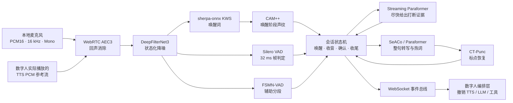
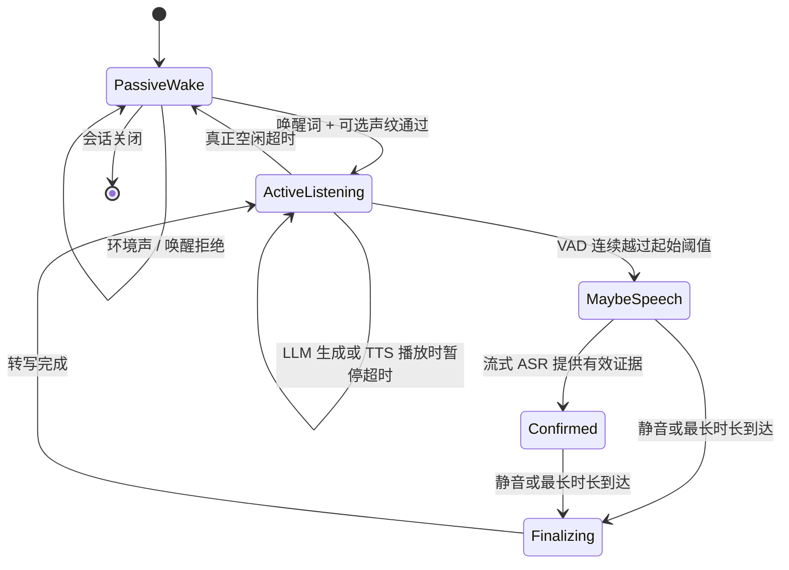
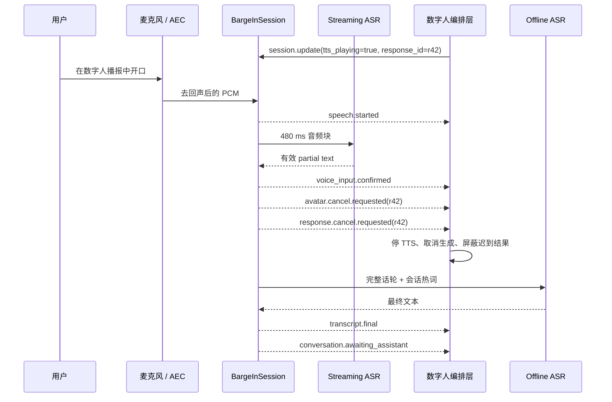

数字人能把话说出来，只完成了“播报”；只有当它在自己说话时仍能听见用户、判断这是不是一句真正的人话，并及时撤销正在生成的内容，对话才开始接近自然交流。

这篇文章介绍我现在使用的 Barge-in 实时语音架构。它运行在纯 CPU 环境中，把麦克风采集、回声消除、降噪、唤醒、端点检测、流式识别、整句识别、声纹和上层任务撤销串成一条可观测的事件管线。重点不在堆了多少模型，而在这些模型如何围绕同一个会话状态机协作。

## Barge-in 到底解决什么问题

“用户一开口就暂停 TTS”看起来像打断，实际很容易被环境声、扬声器回声和无意义短音误触发。另一方面，如果一定等整句话识别完再停，数字人又会显得迟钝。

所以系统要同时回答三个问题：

1. 麦克风里的声音是不是用户发出的，而不是数字人自己的播报？
2. 这段声音是不是有效语音，是否足以提前中止当前响应？
3. 中止以后，怎样让迟到的 LLM、TTS 和工具结果不再回到界面？

我的做法是把“检测到声音”“确认有效输入”和“撤销一次响应”拆成三个不同的阶段。声音出现只改变语音状态；流式 ASR 给出足够证据后才确认打断；最终的整句识别则负责产出高质量文本。

## 整体架构

系统对外提供 REST 和 WebSocket 两个边界。REST 负责会话创建、状态更新、热词和声纹注册；WebSocket 同时承载音频流、控制消息和有序事件。对于和声卡在同一台机器上的数字人，我还提供了一个进程级常驻麦克风模式：前端断线不会关闭麦克风，也不会销毁会话，重新连接后只需继续消费事件。

这两种接入方式最终都进入同一个 `BargeInSession`，所以检测策略和事件语义不会分叉。

## 音频前端：先处理“听见谁”

### AEC 必须拿到真实播放参考

降噪不能代替回声消除。DeepFilterNet3 擅长压制稳定噪声，却不知道扬声器里正在播放什么；要去掉数字人自己的声音，AEC 必须同时拿到麦克风采集流和**实际送往扬声器的 TTS PCM**。

本地模式使用 WebRTC AEC3，以 10 ms 为处理帧。前端在播报开始时发送 `aec.reference.start`，随后按真实播放节奏发送 16 kHz 单声道 PCM，播报结束再发送 `aec.reference.stop`。服务端为参考流维护有界队列，并记录欠载、溢出和处理错误。参考流没跟上时，系统宁可把这个事实暴露在健康数据里，也不假装 AEC 正常工作。

### 降噪是每个会话自己的状态

DeepFilterNet3 内部工作在 48 kHz，而 API 输入统一为 16 kHz。服务使用有状态的三倍插值和抽取器跨数据块保持滤波连续性，并为每个会话创建独立的降噪处理器。这样不会把 A 会话的声学历史带进 B 会话。

模型工作被放进会话专属的单线程执行器，避免阻塞 asyncio 事件循环。默认衰减上限是 12 dB：目标不是把背景抹得一干二净，而是在保留语音可辨识度的前提下，为后面的 VAD 和 ASR 提供更稳定的输入。

### 实时回调只做搬运

PortAudio 的麦克风回调不运行模型、不写日志，只把字节块投递到 asyncio 有界队列。队列满时丢弃最旧块，而不是让回调阻塞声卡线程。系统同时记录采集块、处理块、丢弃块、输入溢出以及单块最长处理时间，这些指标比一句“实时性很好”更诚实。

## 一次唤醒，多轮对话

默认模式不是每句话都要喊唤醒词。会话从 `passive_wake` 开始，KWS 命中后进入激活状态；之后的每个有效话轮直接转写，只有在用户长时间没有有效输入、且数字人既不在生成也不在播报时，才退回待唤醒。

声纹校验也只发生在唤醒阶段。CAM++ 对包含唤醒词的音频窗口提取向量，与已登记声纹计算余弦相似度。通过以后，后续话轮不再重复验证，从而兼顾入口控制与自然对话。

空闲计时器有一个容易忽略的细节：当 `assistant_processing` 或 `tts_playing` 为真时必须暂停，而不是继续倒计时。否则数字人说一段较长内容后，会话可能在播报途中悄悄退回待唤醒，用户接着说话却得不到响应。

## 双 VAD、双 ASR，各做一件事

Silero VAD 每 512 个采样点，也就是 32 ms，给出语音概率。系统再叠加 RMS 能量门限和起止滞回：起始阈值较高、结束阈值较低，避免概率在临界点抖动。320 ms 的 pre-roll 会补回触发之前的音频，防止吃掉第一个字。

FSMN-VAD 以更大的音频块提供辅助分段信息，但会话边界仍由统一状态机控制。两个 VAD 不是投票关系，而是快速判定与模型分段各司其职。

ASR 也分成两条路径：

- Streaming Paraformer 每 480 ms 消费一块音频，追求尽快形成“这确实是一句话”的证据；
- SeACo 或离线 Paraformer 在话轮结束后处理完整音频，追求最终文本质量，并在上下文模型可用时注入热词；
- CT-Punc 只处理最终文本，原始识别结果仍保留在事件中，方便调试和评测。

默认 `hybrid` 策略会在流式文本稳定达到两个字符后确认输入。它比“任何声音立即打断”稳，也比“等整句结束”快。系统仍保留 `any_speech` 和 `keyword_only`，用于对延迟或误触发更敏感的场景。

## 打断不是暂停按钮，而是一组撤销语义

用户开口时，当前响应可能同时存在于多个层次：页面正在播 TTS，服务端还在生成后续 token，某个工具调用也可能尚未结束。只停播放器会让迟到数据再次把界面“复活”。

因此，状态机确认有效输入后会发出两类事件：

- `avatar.cancel.requested`：要求数字人立即停止当前播报；
- `response.cancel.requested`：携带 `response_id`，要求上层取消生成、TTS 和可取消工具，并丢弃同一响应的迟到结果。

每个事件都包含会话 ID、递增序号和时间戳。事件队列有上限，音量和 partial 之类的高频事件可以被舍弃；状态变化事件则会淘汰一条旧事件，尽量保住最新控制语义。音频采集永远不应因为前端来不及读事件而停住。

## 模型管理与 CPU 资源

服务启动时统一加载并预热模型，真实请求不承担第一次图初始化的延迟。Silero 使用 ONNX Runtime 串行执行，并关闭线程池空转；FunASR 模型明确传入同一份线程预算，避免多个模型争抢全局 PyTorch 线程。

共享模型的推理由锁串行化，而会话自己的缓存、KWS stream、VAD stream、降噪状态和 pre-roll 都彼此隔离。当前部署坚持 `workers=1`，因为多 worker 会把整套大模型在内存里复制多份。需要扩容时，更合理的方式是启动多个独立实例，再按会话做粘滞路由。

模型加载失败也分核心与可选能力。健康检查会列出每个模型的 `ready`、`disabled` 或 `error` 状态；可选模型失败不必拖垮整个 API，但客户端能明确知道声纹、降噪或离线转写是否可用。

## 热词为什么放在最终识别

热词表既可以来自环境变量或文件，也可以通过 API 在运行时替换。SeACo 在每次整句推理时读取当前热词，因此修改后下一话轮即可生效，不需要重新加载模型。

系统还会在应用热词前检查字符是否存在于模型词表。很多“接口返回成功但热词毫无效果”的问题，本质是字符被静默替换成了 `<unk>`。把不可用字符、大小写建议和当前上下文模型状态直接暴露出来，比盲目提高热词权重可靠得多。

## 这套设计刻意保留的边界

这不是一个无限横向扩展的通用语音云，而是一套靠近声卡、面向数字人实时交互的 CPU 服务。它刻意接受了一些边界：

- 全链路统一为 PCM16、16 kHz、单声道，格式转换留在入口之外；
- 远程模式要求上游完成 AEC，本地模式才接收真实 TTS 参考流并运行 AEC3；
- 会话和声纹当前驻留内存，进程重启后需要重建；
- 单进程共享模型，换取可控的内存和线程占用；
- “确认打断”依赖文本证据，延迟与误触发之间通过策略和阈值调节，而不是宣称存在一个万能阈值。

这些限制不是遗漏，而是为了让实时链路的责任边界保持清晰。先保证每一帧音频去了哪里、每一次状态变化为什么发生，再谈分布式扩容，会比一开始就把系统拆成许多服务更稳。

## 结语

Barge-in 最难的部分从来不是调用一个 VAD 或 ASR 模型，而是协调声学链路、时间边界和业务撤销。

我现在这套架构的核心可以归结为三点：用真实播放参考解决“听见谁”，用流式证据和整句识别分工解决“何时相信”，再用带 `response_id` 的事件协议解决“怎样真的停下来”。当这三件事被同一个会话状态机串起来，数字人才不只是会说话，而是开始具备对话中的节奏感。
